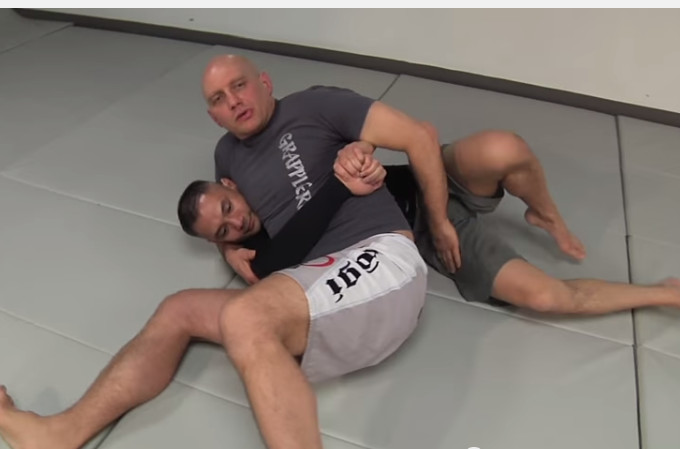
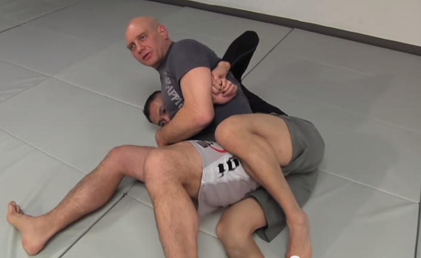
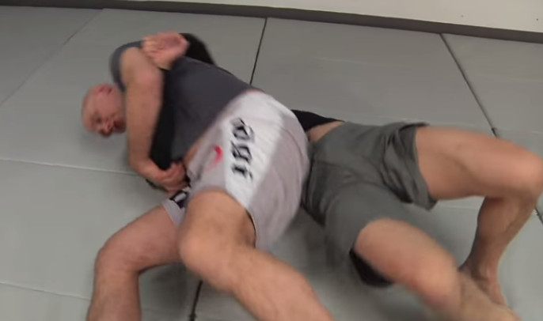
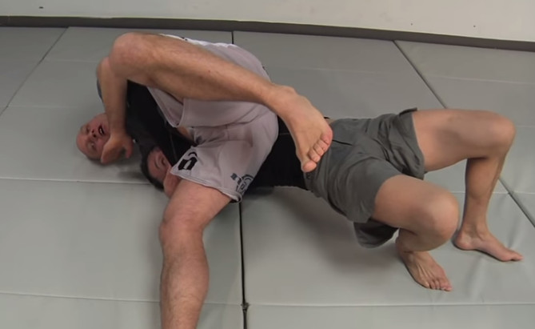
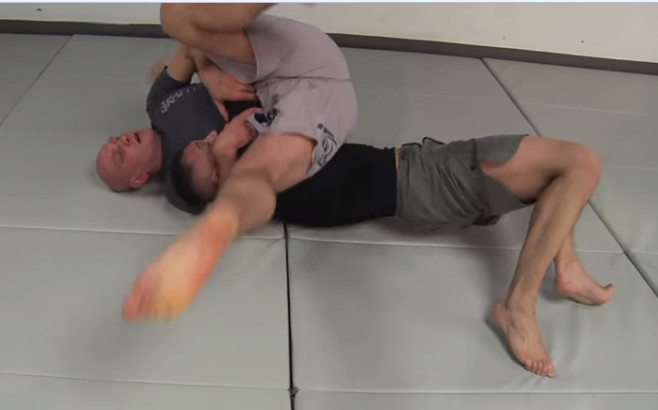
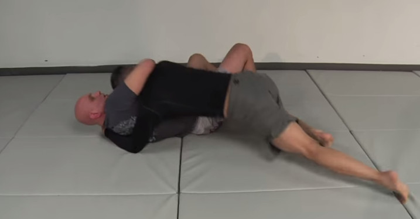

# Kesa gatame escape (two bridges)
source: How to Escape Kesa Gatame and the Headlock

https://www.youtube.com/watch?v=9Im8IKc8NeY

### Notes

- always stay on your side when under immobilisation

### Step 1: apply pressure

- apply pressure just below the floating ribs
    - go a bit upward
- controls the body a bit (uke won't tap out from this)

### Step 2: get hips close

- want to get hips close to uke's hips

### Step 3: bridge

- this time, bridge with an angle towards the shoulder
    - will land him on his head

### Step 4: bridge again

- this time, go towards your other shoulder, 90 degrees to body line

- take control, can go to armbar

