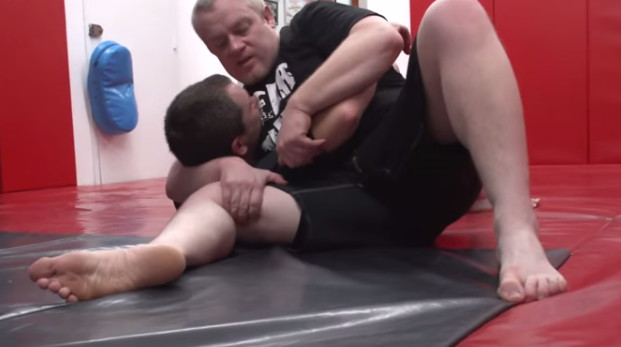
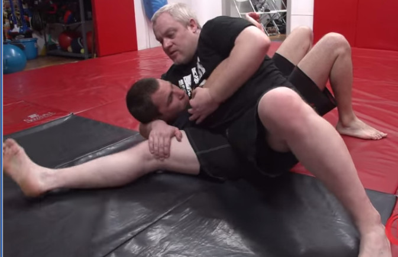
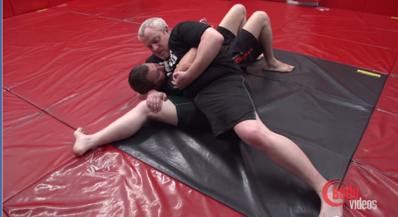
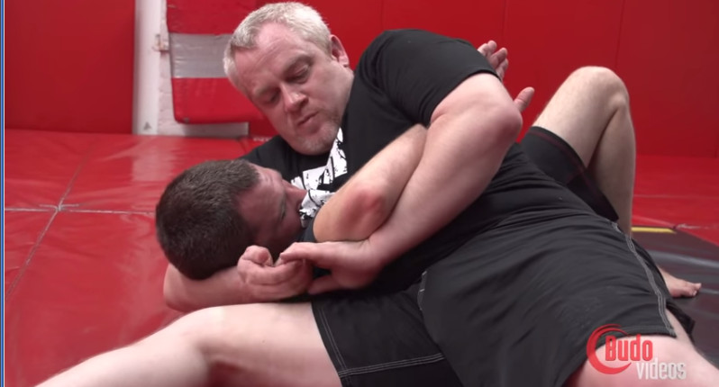
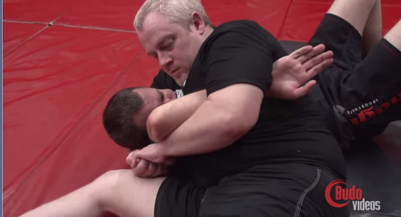

# Kimura from kesa gatame
source: Rolled Up Episode 35 - Fear the Reaper with Stephen Koepfer

https://www.youtube.com/watch?v=Jf0mVCDra5I at around 39 minutes

### Step 1: lift head

- head AND shoulder of uke lifted from ground
- hips just a bit off the ground
    - keeps center of gravity low, but puts weight on uke
- legs positioned to avoid reversal
- grab leg if nogi, otherwise choose appropriate gi grip (not sure which one)

- control the arm
- can mess with it to make him wrap it around

### Step 2: compress

- time with breathing, when uke exhales, slide downward
    - if uke is flat (not on his side), can tap him that way

### Step 3: close the kimura

- when tori is low enough
- close finger grip (nogi), maybe better grip in gi
- CONTROL THE WRIST! (beneath armpit)

- wrist should be under lower part of the elbow and hand under control
- finish the kimura by lifting the elbow
