# Fredson Paixao wristlocks

## Reversals exercise (develop grip position)

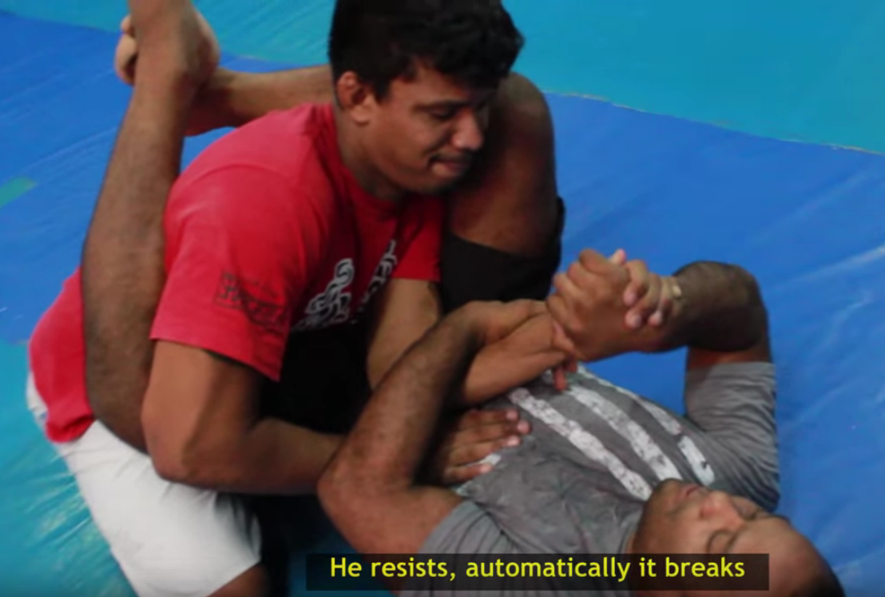

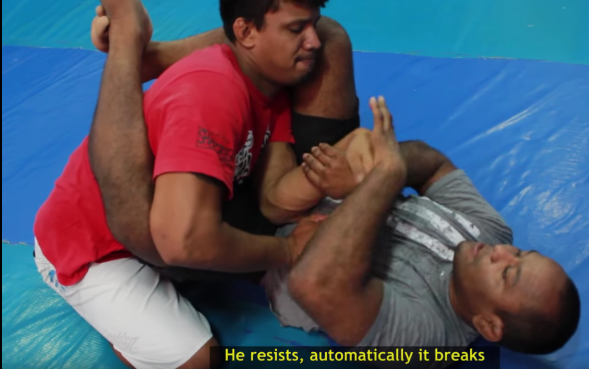

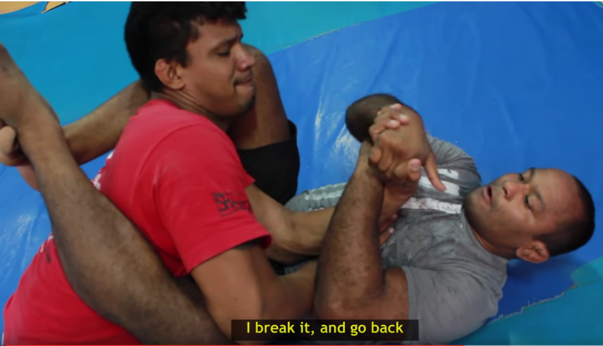

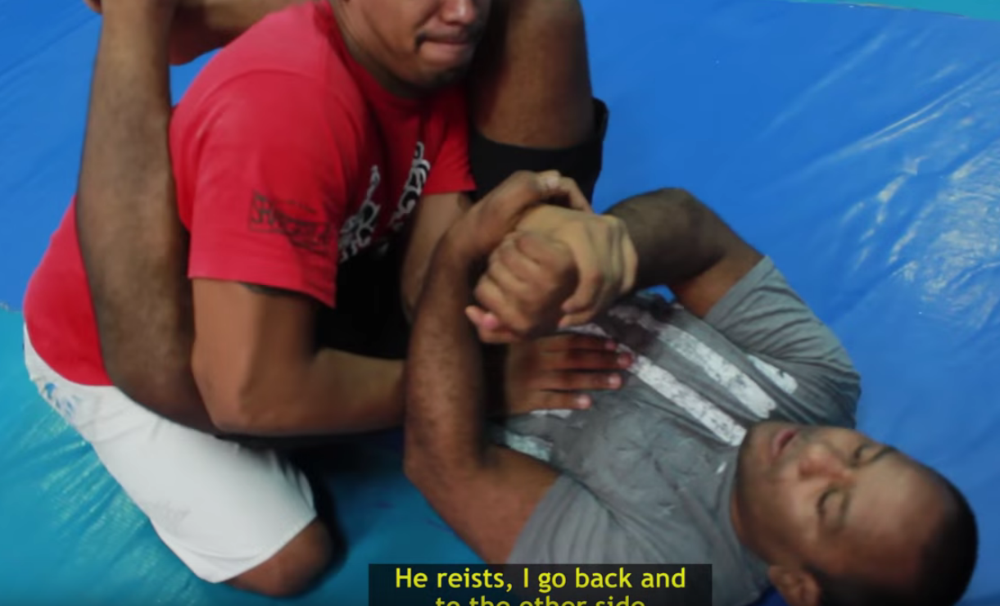

## Closed guard wristlock (https://youtu.be/aXVRetywLWU?t=313)

Start from closed guard. Opponent tries to post his hands into pelvis.
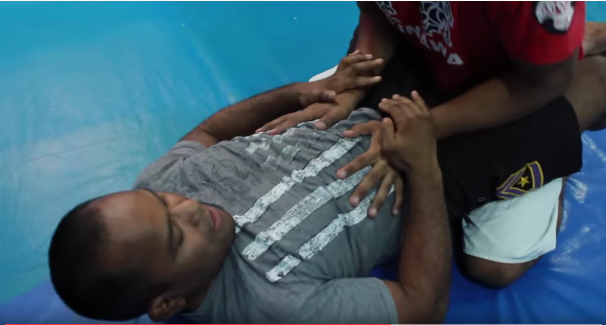

Acquire the right elbow with right hand.
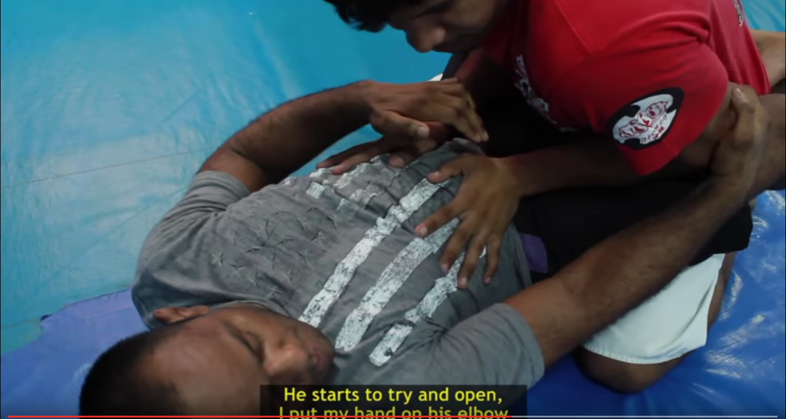

Block right hand with left hand.
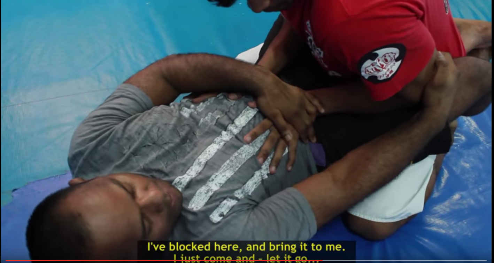

Crank back the elbow, applying pressure on the right hand.
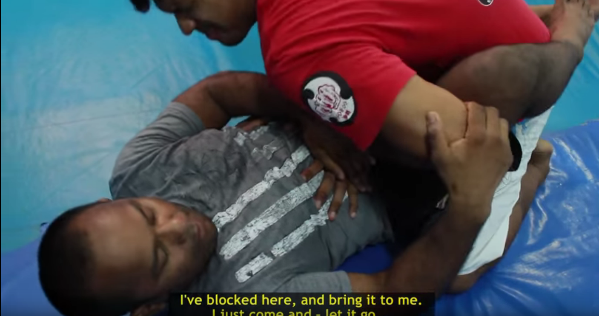

Once the looseness of the right hand is gone, crank the elbow with two arms.
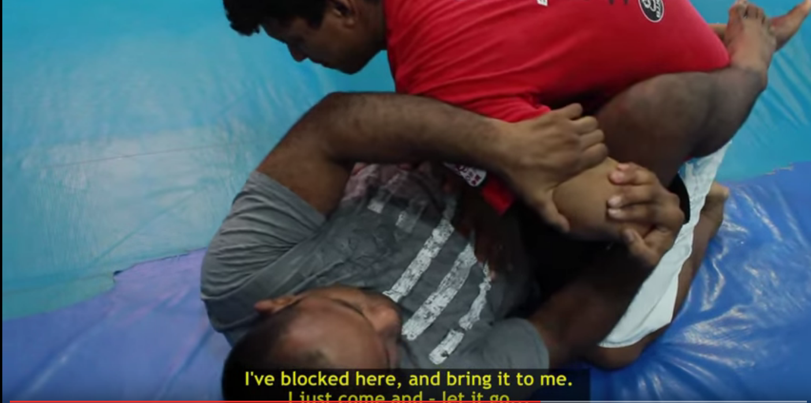

## triangle-like wristlock

Opponent grabs the right arm with left hand, from closed guard.

Drag the right arm up and aquire elbow with left hand (inside of the elbow, long finger grip).
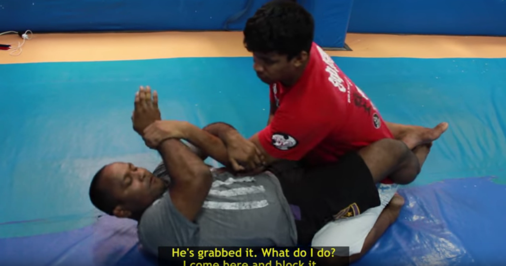

Close a triangle using right knee over shoulder.
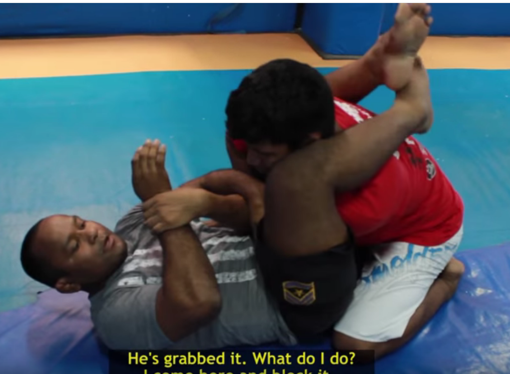

Flip the wrist with the right hand (kinda hard).
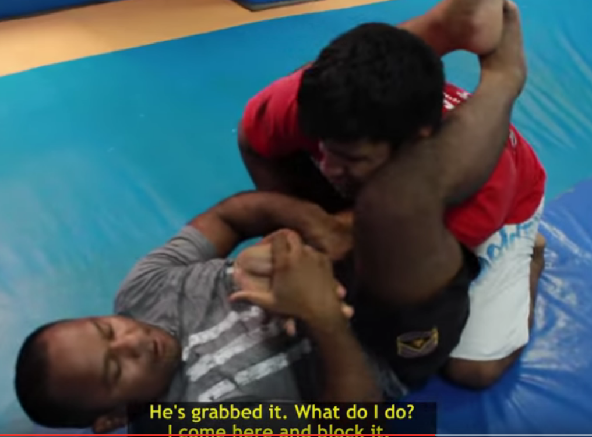

Two hand crank the wrist backwards (fingers up).
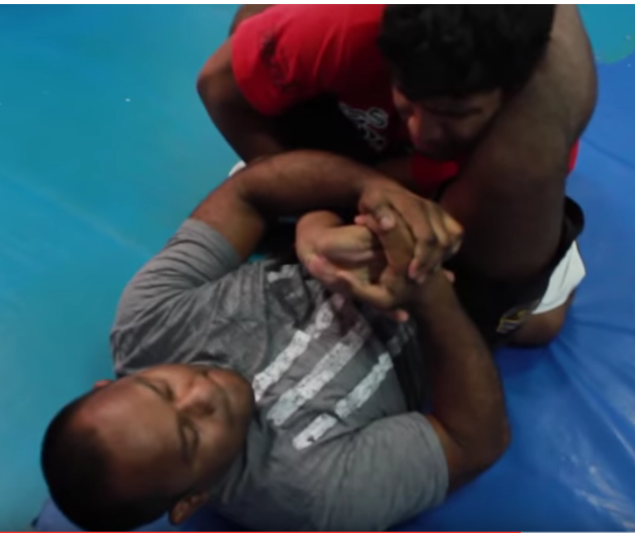

